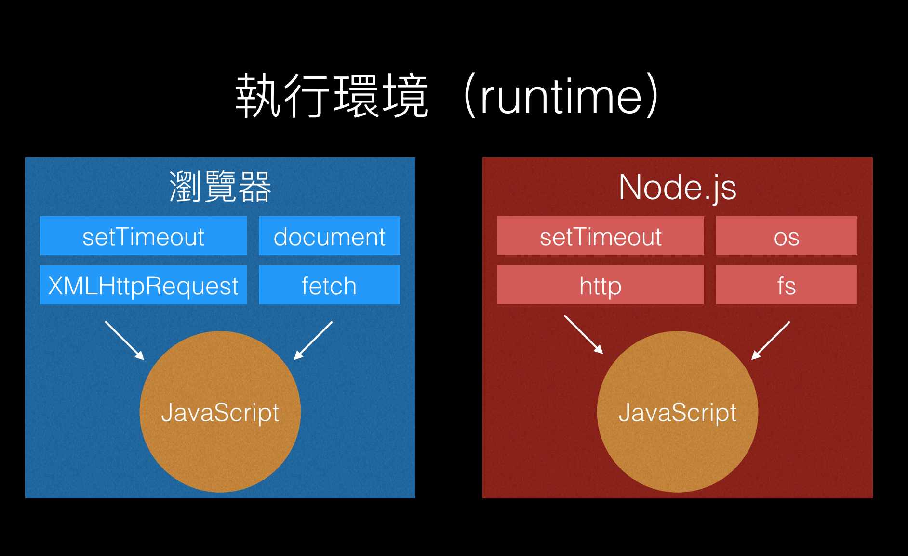

# JavaScript 為什麼會有 Asynchronous 的概念出現？

<details>
  <summary>**前情提要** </summary>
:::info   
Asynchronous 的翻譯叫做「非同步」，<br />
你可能會很難想像對一個程式語言套用「非同步」是一個怎麼樣的概念，或是怎麼樣的一件事情。

不過在解說之前，需要先強調一下，不同程式語言的「非同步」概念可能是不一樣的，接下來只會著重在 JavaScript 的非同步概念上。

JavaScript 的非同步概念簡單來說可以這樣理解：<br />
「是 JavaScript 的執行方式，當程式執行到某個需要等待的指令時（例如網路請求、檔案讀取、計時器等），不會等這個指令執行完才執行下一個指令，而是將需要等待的指令丟到<u>其他地方（事件佇列, Event Queue）</u>，然後往下執行下一個指令。」
:::

</details>

在回答標題的問題之前，需要先談**執行環境（runtime）。**

什麼是執行環境？ JavaScript 在誰身上跑誰就是執行環境。

## 執行環境 runtime

JavaScript 是一個程式語言，會有此語言本身規範所可以用的東西，例如說用 `var` 宣告變數、用 `if else` 進行判斷、用 `function` 宣告函式等等，這些東西都是 JavaScript 這個語言本身就有的東西。

也就代表說，**會有一些東西是「不屬於 JavaScript 這個語言的」**。

例如說執行 `document.querySelector('body')` 可以讓你拿到 body 的 DOM 物件，並且可以對此物件做操作，而操作後的結果會即時反應在瀏覽器的畫面上。

不過這個  `document.querySelector()`  是哪來的？<br />
其實是瀏覽器提供給 JavaScript 的工具，讓  JavaScript  可以透過 `document.querySelector()` 這個工具與瀏覽器進行溝通、操控 DOM。

如果去翻  [ECMAScript](https://www.ecma-international.org/publications/standards/Ecma-262.htm)  的文件，會發現裡面完全沒有出現`document.querySelector()` 這個東西，因為它不是 JavaScript 這個程式語言本身的一部份，而是瀏覽器提供的。

其中因為 JavaScript 在「瀏覽器」上面跑，所以我們可以把瀏覽器稱作是 JavaScript 的「**執行環境（runtime）**」，因為 JavaScript 就跑在上面嘛，十分合理。

另外還有別的執行環境，也就是 Node.js。

不同的執行環境，提供給 JavaScript 的工具也不一樣，如下圖所示：



執行環境不同，使用 JS 的方法也不同。

以瀏覽器來說，會用 `<script src="index.js">` 引入一個 JavaScript 檔案，就可以在瀏覽器上執行；
以 Node.js 來說，必須先在電腦上安裝 Node.js 這個執行環境，然後以 CLI 的方式用`node index.js`這個指令來執行。

### 重點

1. JavaScript 只是程式語言，需要搭配執行環境提供的工具才可以做其他事，例如說  `setTiemout`、`document.querySelector()`  等等。
2. 最常見的 JavaScript 執行環境有兩個，一個是**瀏覽器**，一個是 **Node.js**。
3. 不同的執行環境會提供不同的東西，例如 Node.js 提供了 `http` 這個工具讓 JavaScript 可以寫一個伺服器，但瀏覽器就沒有提供這種東西。

## 回答 JavaScript 為什麼會有 Asynchronous 的概念

在現實世界中，正在執行的程式常常需要跟「外界」溝通，溝通就是拿資料或交換資料，然後對於正在執行的程式來說，外界就是「當前執行環境以外的執行環境」。

這個解釋其實很合理，因為不可能全世界所有的程式、所有的資料，都待在同一個執行環境。<br />
例如不可能全世界的程式語言都可以在瀏覽器上執行（如果可以，那也不需要有那麼多語言了，只需要存在一個可以在瀏覽器上執行的語言就好），
因此不同的執行環境之間如果要溝通，就需要執行環境與執行環境之間有提供可以互相溝通的「工具）」，並在滿足溝通<u>規範（通常叫 API）</u> 後開始溝通。

對瀏覽器來說，「工具」可能就是指 `setTiemout`、`promise`、`fetch API` 等等，瀏覽器提供這些工具給 JavaScript，讓開發者可以透過 JS 去使用這些工具來跟「外界」溝通拿取需要的資料。

我們已經知道執行環境會提供工具，讓開發者跟其他執行環境做溝通，那接下來要問的問題就會是：

1. 工具怎麼使用？（後面的章節會提到）
2. 使用這些工具時，在程式中執行的過程是怎麼樣？這是我們現在要聊的

用下面這個例子簡單說明一下，使用這些工具時，在程式中執行的過程是怎麼樣？

- Node.js 有提供控制檔案的工具，讓我們可以寫一段 JavaScript 來讀取與寫入檔案：

  ```javascript
  const fs = require("fs"); // 引入內建的 file system 模組
  const file = fs.readFileSync("./README.md"); // 讀取檔案
  console.log(file); // 印出內容
  ```

  看起來好像沒什麼問題，如果檔案小的話確實是沒什麼問題，但如果檔案很大呢？

  假設檔案有 1000MB 好了，要把這麼大的檔案讀進記憶體，可能要花個幾秒鐘甚至更久。<br />
  如果在讀取檔案的時候，程式就停在第二行，等讀完檔案把內容放到 `file` 變數裡才執行第三行 `console.log(file)`的話，
  代表 `fs.readFileSync` 這個方法「阻擋」了後續指令的執行，程式可能會被「block」 在這裡，直到這個 method 拿到回傳值。

  如果接續的指令，必須拿到讀取檔案的內容後才可以操作，例如尋找檔案裡的某個字串等等，那這樣其實沒什麼問題，

  可是如果不是呢？不就虧大了？<br />
  因此 JS 才會有一個機制（像是 Event Loop），讓這些能跟「外界溝通」的工具，在被執行到的時候，不會阻擋後續的指令執行。

  **<u>這就是為什麼 JavaScript 會有 Asynchronous 的概念</u>**。

  這樣的設計，讓程式在執行的過程中，可以同時進行多個「外界溝通」，而不是一個一個執行然後等待。

  為了避免被這些會跟外界溝通的工具阻擋，在程式中執行的順序大概是這樣：<br />
  「當程式執行到使用這些工具的指令時，會將這些工具的指令挪到其他地方繼續執行，執行完後有結果了，再將結果回傳就好。」

  畢竟對使用者來說，那些工具的執行過程一點都不重要，他們只要知道結果就好，不論結果是成功還是失敗，都是一種結果。
